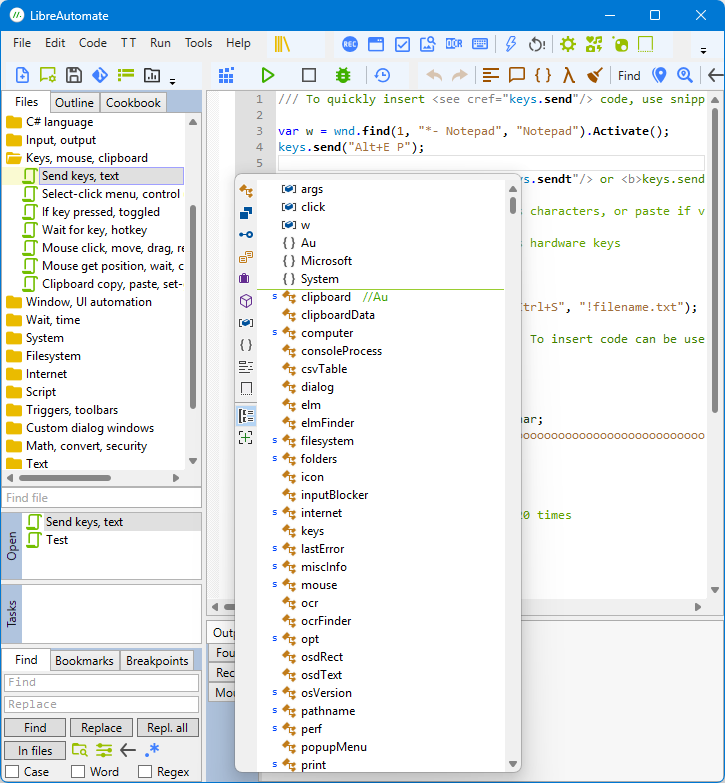

# LibreAutomate C#

The program is an integrated scripting environment for creating and executing automation scripts using its automation library and C# programming language.

In the main window: code editor, several panels, toolbars and menu bar. Also there is a tray icon. The main window can be hidden, it depends on program settings.

## Code editor
Here you edit automation scripts and other text files.
[Features](xref:code_editor).

Multiple files can be open, but only one is visible. The list of open files is in the **Open** panel.

All changes are saved automatically on these events: app deactivated, main window closed, timer. The **Save** button saves all changes immediately.

## Panels
Panels and toolbars can be docked, floating or hidden.

### Files
All files and folders of current workspace.

Click an item to open in the code editor. Right-click to show context menu. Middle-click to close. Drag and drop to reorder or add new files.

All changes are saved automatically.

Deleted files and folders are moved to the Recycle Bin if possible.

Yellow background if the file is open in the code editor.

C# code files have `.cs` extension, but it is hidden.

File properties are documented in the **Properties** dialog.

Files are of these types:
- Script - C# code file that can be executed directly, like a program.
- Class - C# code file that cannot be executed directly but contains code used by other files.
- Text files - txt, xml and other files that can be edited in the code editor.
- Other files - files that cannot be edited. Images etc. For example can be added to assembly resources.

Folders are of these types:
- Simple folders.
- Folders named like `@Name` are [project](xref:class_project) folders.

The collection of files and folders is a *workspace*. It is a folder on disk. In the folder:
- Folder `files` contains files and folders of the workspace.
- File `files.xml` is the list of files and folders of the workspace.
- File `settings.json` - workspace settings.
- File `bookmarks.csv` - saved bookmarks.
- Folder `.state` contains code editor states for files, such as folding, markers and current position.
- The `.xxx` folders are created and used by the program for various purposes.
- Folders `exe` and `dll` - default folders for files created when compiling code files with role `exeProgram` or `classLibrary`.

### Open
List of files open in the code editor.

Right-click - context menu. Middle-click - close.

### Tasks
Running scripts.

Right-click - context menu. Middle-click - close.

### Find
Find and replace text in the code editor or in multiple files.

Right-click an edit field - context menu. Middle-click - clear text; if empty - show recent.

### Found
Results of **Find in files**, **Find file**, **Find references** and some other commands.

### Output
The program writes various info here. For example script compilation errors. Scripts use [print.it]() for it.

Right-click - context menu. Middle-click - clear.

### Mouse
Mouse x y, window name/class/program, control id/class/name, menu item id.

### Outline
Helps to find types, functions, fields, namespaces and regions in current C# code file.

### Cookbook, Recipe
Automation code examples and info.

### Bookmarks
List of bookmarks.

Right-click - context menu.

### Debug, Breakpoints
[Debugger](Debugger.md).

## Menus

### File
File and workspace management.

### Edit
Code editing.

### Code
Tools that help to create code.

### TT
Triggers and toolbars.

### Run
Execute current script. Or just compile.

### Tools
Tool windows.

### Help
Program help and library reference.

## Tray icon
Click - show and activate editor window. Right-click - show context menu.

Gray when triggers are disabled.
